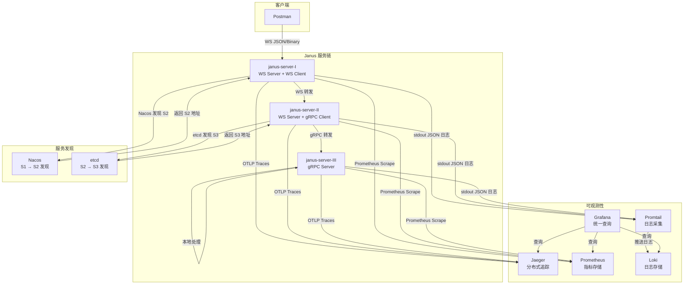

# Janus Server 架构文档

## 1. 概述

Janus Server 是一个统一通信服务器，同时支持 **WebSocket JSON**、**WebSocket Binary** 和 **gRPC（4 种模型）** 协议。通过 Nacos 和 etcd 实现服务注册与发现，并内置 metrics / logging / tracing 全链路可观测能力。

### 请求链路

```
Postman ──[WS JSON/Binary]──▶ janus-server-I ──[Nacos 发现]──▶ janus-server-II ──[etcd 发现]──▶ janus-server-III
      (入口)                    (WS 转发)              (中间节点)              (gRPC 转发)            (终端处理)
```

| 节点 | 接收协议 | 转发协议 | 服务发现 | 服务注册 |
|------|---------|---------|---------|---------|
| janus-server-I | WebSocket (Postman 直连) | WebSocket | Nacos | 无 |
| janus-server-II | WebSocket (S1 → S2) | gRPC | etcd | Nacos |
| janus-server-III | gRPC (S2 → S3) | 无 (本地处理) | 无 | etcd |

---

## 2. 系统架构图



---

## 3. 技术栈

| 层级 | 技术 | 版本 | 用途 |
|------|------|------|------|
| 语言 | Java | 25 | 主开发语言 |
| 构建 | Maven | 3.9+ | 项目构建与依赖管理 |
| WebSocket | Java-WebSocket | 1.5.7 | WS 服务端与客户端 |
| gRPC | grpc-java | 1.82.1 | gRPC 4 种通信模型 |
| 序列化 | Protocol Buffers | 3.24.3 | gRPC 消息序列化 |
| JSON | Jackson | 2.18.2 | WS JSON 消息序列化 |
| 服务发现 | Nacos | 3.2.2 | S1 → S2 服务注册与发现 |
| 服务发现 | etcd (jetcd) | 0.8.6 / v3.6.13 | S2 → S3 服务注册与发现 |
| 追踪 | OpenTelemetry | 1.63.0 | 链路追踪 SDK |
| 追踪 | Jaeger | 1.76.0 | 分布式追踪后端 |
| 指标 | Prometheus | v3.13.0 | 指标采集与存储 |
| 日志 | Loki + Promtail | 3.6.11 | 日志采集与存储 |
| 可视化 | Grafana | 12.2.10 | 统一查询 UI |
| 日志框架 | Log4j2 | 2.26.1 | 结构化 JSON 日志输出 |

---

## 4. 模块架构

```
janus-server-java/
├── src/main/java/org/janus/
│   ├── JanusServer.java          # 主入口，编排所有组件
│   ├── Constants.java               # 常量：追踪 Key、Context Key
│   ├── config/
│   │   └── ServerConfig.java        # 环境变量配置
│   ├── codec/
│   │   └── BinaryCodec.java         # WS Binary 协议编解码器
│   ├── model/
│   │   └── JanusMessage.java     # WS JSON 消息模型 (Java Record)
│   ├── common/
│   │   └── HelloUtils.java          # 问候语工具
│   ├── ws/
│   │   ├── JanusWsServer.java    # WS 服务端 (JSON + Binary)
│   │   └── JanusWsClient.java    # WS 客户端 (链路转发)
│   ├── grpc/
│   │   ├── JanusServiceImpl.java # gRPC 服务实现 (4 模型)
│   │   ├── JanusGrpcServer.java  # gRPC 服务端
│   │   ├── JanusGrpcClient.java  # gRPC 客户端 (链路转发)
│   │   ├── HeaderServerInterceptor.java
│   │   └── HeaderClientInterceptor.java
│   ├── discovery/
│   │   ├── ServiceRegistry.java     # 注册发现接口
│   │   ├── NacosRegistry.java       # Nacos 实现
│   │   ├── EtcdRegistry.java        # etcd 实现
│   │   ├── EtcdNameResolver.java    # gRPC etcd 名称解析器
│   │   ├── EtcdNameResolverProvider.java
│   │   ├── NacosNameResolver.java   # gRPC Nacos 名称解析器
│   │   └── NacosNameResolverProvider.java
│   ├── observability/
│   │   ├── OtelSupport.java         # OpenTelemetry 初始化
│   │   └── TracingHelper.java       # Span 创建与上下文传播
│   └── handler/
│       └── ChainHandler.java        # 请求链路编排
├── src/main/proto/
│   └── janus.proto               # gRPC Proto 定义
├── src/main/resources/
│   └── log4j2.xml                   # 日志配置 (JSON 格式输出)
└── docker/
    ├── Dockerfile
    ├── docker-compose.yml
    ├── prometheus.yml
    ├── loki-config.yml
    ├── promtail-config.yml
    └── grafana/provisioning/
        └── datasources/datasources.yml
```

---

## 5. 核心组件

### 5.1 JanusServer (主入口)

[JanusServer.java](../src/main/java/org/janus/JanusServer.java) 是整个服务的主入口，负责：

1. 初始化 OpenTelemetry SDK
2. 创建服务注册中心连接（Nacos / etcd）
3. 注册自身到注册中心
4. 启动 gRPC 服务端
5. 连接下游 gRPC 客户端（如配置）
6. 创建 ChainHandler（链路处理器）
7. 连接下游 WS 客户端（如配置）
8. 启动 WebSocket 服务端
9. 注册 JVM Shutdown Hook

### 5.2 WebSocket 服务端

[JanusWsServer.java](../src/main/java/org/janus/ws/JanusWsServer.java) 基于 Java-WebSocket 库，通过路径路由支持两种协议：

- `ws://host:port/json` — JSON 文本消息
- `ws://host:port/binary` — 二进制协议消息

收到消息后委托给 `ChainHandler` 处理。

### 5.3 gRPC 服务端

[JanusGrpcServer.java](../src/main/java/org/janus/grpc/JanusGrpcServer.java) 使用 Netty 构建 gRPC 服务端，提供 4 种 RPC 模型：

| 方法 | 模型 | 说明 |
|------|------|------|
| `Talk` | Unary | 一元 RPC，请求-响应 |
| `TalkOneAnswerMore` | Server Streaming | 服务端流式，一请求多响应 |
| `TalkMoreAnswerOne` | Client Streaming | 客户端流式，多请求一响应 |
| `TalkBidirectional` | Bidirectional Streaming | 双向流式 |

### 5.4 ChainHandler (链路编排)

[ChainHandler.java](../src/main/java/org/janus/handler/ChainHandler.java) 根据配置决定请求处理方式：

```
收到请求
  ├── downstream = grpc → 通过 gRPC 客户端转发到下游
  ├── downstream = ws   → 通过 WS 客户端转发到下游
  └── downstream = none → 本地处理（终端节点）
```

每次处理创建 OpenTelemetry Span，实现全链路追踪。

### 5.5 服务发现

#### Nacos 注册与发现

[NacosRegistry.java](../src/main/java/org/janus/discovery/NacosRegistry.java) 实现：
- `register()` — 注册实例（IP + Port + Protocol 元数据）
- `discover()` — 查询所有健康实例
- `deregister()` — 注销实例

#### etcd 注册与发现

[EtcdRegistry.java](../src/main/java/org/janus/discovery/EtcdRegistry.java) 实现：
- 使用 etcd Lease + KeepAlive 实现健康检查
- Key 格式：`janus-server/grpc://host:port`
- TTL = 10 秒，到期自动剔除

#### gRPC Name Resolver

对于 gRPC 客户端，项目实现了自定义 NameResolver，使 gRPC 原生支持服务发现：

- [EtcdNameResolver.java](../src/main/java/org/janus/discovery/EtcdNameResolver.java) — 监听 etcd key 变化，动态更新地址列表
- [NacosNameResolver.java](../src/main/java/org/janus/discovery/NacosNameResolver.java) — 查询 Nacos 实例列表

---

## 6. 可观测性架构

### 6.1 三大信号

| 信号 | 采集方式 | 存储后端 | 查询方式 |
|------|---------|---------|---------|
| **Tracing** | OpenTelemetry SDK → OTLP gRPC | Jaeger | Jaeger UI / Grafana |
| **Metrics** | OpenTelemetry SDK → Prometheus HTTP Server | Prometheus | Prometheus UI / Grafana |
| **Logging** | Log4j2 JSON → stdout → Promtail | Loki | Grafana LogQL |

### 6.2 追踪链路传播

```
Postman → S1 (WS Server Span) → S1 (WS Client Span) → S2 (WS Server Span) → S2 (gRPC Client Span) → S3 (gRPC Server Span)
```

每个节点：
1. 从上游提取 TraceContext（WS: JSON 字段 / gRPC: Metadata）
2. 创建 Server Span（继承父 Span）
3. 创建 Client Span（传播到下游）
4. 注入 TraceContext 到下游（WS: JSON 字段 / gRPC: Metadata）

### 6.3 日志关联

Log4j2 输出 JSON 格式日志，包含 MDC 中的 `traceId` 和 `spanId`：

```json
{"timestamp":"2026-07-05T15:56:48,123","level":"INFO","logger":"org.janus.handler.ChainHandler","traceId":"abc123def456","spanId":"7890abcdef","message":"Forwarding via gRPC: data=0, meta=postman"}
```

Promtail 解析 JSON 并将 `traceId`/`spanId` 提取为 Loki 标签，支持通过 Trace ID 关联查询跨节点日志。

### 6.4 Grafana 统一查询

Grafana 自动配置三个数据源：
- **Loki** — LogQL 查询日志
- **Prometheus** — PromQL 查询指标
- **Jaeger** — 查询追踪链路

支持交叉跳转：
- 日志中的 `traceId` 可点击跳转到 Jaeger Trace 视图
- Jaeger Trace 可跳转到对应 Loki 日志

---

## 7. Docker Compose 服务拓扑

```
┌─────────────────────────────────────────────────────────────────┐
│                      Docker Network: janus-net                │
│                                                                  │
│  ┌──────────┐  ┌──────────┐  ┌──────────┐                       │
│  │  Nacos   │  │  etcd    │  │  Jaeger  │                       │
│  │ :8848    │  │ :2379    │  │ :16686   │                       │
│  └────┬─────┘  └────┬─────┘  └────┬─────┘                       │
│       │              │              │                             │
│  ┌────┴──────────────┴──────────────┴─────┐                      │
│  │      janus-server-I (:8080)         │                      │
│  │      WS receive → WS forward (Nacos)   │                      │
│  └────────────────────────────────────────┘                      │
│  ┌────────────────────────────────────────┐                      │
│  │      janus-server-II (:8080)         │                      │
│  │      WS receive → gRPC forward (etcd)  │                      │
│  └────────────────────────────────────────┘                      │
│  ┌────────────────────────────────────────┐                      │
│  │      janus-server-III (:9090)         │                      │
│  │      gRPC receive → local process      │                      │
│  └────────────────────────────────────────┘                      │
│                                                                  │
│  ┌──────────┐  ┌──────────┐  ┌──────────┐  ┌──────────┐         │
│  │Prometheus│  │   Loki   │  │ Promtail │  │ Grafana  │         │
│  │ :9090    │  │ :3100    │  │ (collect)│  │ :3000    │         │
│  └──────────┘  └──────────┘  └──────────┘  └──────────┘         │
└──────────────────────────────────────────────────────────────────┘
```

---

## 8. 环境变量配置

| 环境变量 | 默认值 | 说明 |
|---------|--------|------|
| `JANUS_SERVER_ID` | janus-&lt;pid&gt; | 服务器实例 ID（未设置时默认取进程 PID） |
| `JANUS_WS_PORT` | 8080 | WebSocket 服务端口 |
| `JANUS_GRPC_PORT` | 9090 | gRPC 服务端口 |
| `JANUS_METRICS_PORT` | 9100 | Prometheus 指标端口 |
| `JANUS_ADVERTISED_HOST` | localhost | 注册到发现中心的地址 |
| `JANUS_DOWNSTREAM_PROTOCOL` | none | 下游协议：ws / grpc / none |
| `JANUS_DOWNSTREAM_DISCOVERY` | none | 下游发现：nacos / etcd / none |
| `JANUS_DOWNSTREAM_SERVICE` | janus-server | 下游服务名 |
| `JANUS_REGISTER` | none | 注册中心：nacos / etcd / none |
| `JANUS_NACOS_ENDPOINT` | localhost:8848 | Nacos 地址 |
| `JANUS_ETCD_ENDPOINT` | http://localhost:2379 | etcd 地址 |
| `JANUS_OTEL_ENABLED` | Y | 是否启用 OpenTelemetry |
| `OTEL_EXPORTER_OTLP_ENDPOINT` | http://localhost:4317 | OTLP 端点 |
| `OTEL_SERVICE_NAME` | janus | 服务名称（代码自动追加 `-{SERVER_ID}`） |
| `JANUS_AUTH_TOKEN` | （空） | 可选的 WebSocket 共享令牌鉴权。留空（默认）时保持开放不校验；设置后入站 WS 握手须携带匹配的 `authToken` 请求头，下游 WS 转发客户端亦自动携带 |

---

## 9. 设计决策

### 9.1 单一代码库多角色

三个服务节点运行同一份代码，通过环境变量配置不同角色。优点：
- 无需维护多个项目
- 所有节点同时支持 WS 和 gRPC，灵活性高
- 角色切换只需改环境变量

### 9.2 OpenTelemetry 作为可观测性标准

选择 OpenTelemetry 而非各自独立的 SDK：
- 统一的 API 和 SDK
- 支持 OTLP 协议，可对接多种后端
- gRPC 和 WS 都可通过同一套 Span 传播机制串联

### 9.3 Grafana 统一查询

选择 Grafana 作为统一 UI：
- 同时支持 Loki（日志）、Prometheus（指标）、Jaeger（追踪）
- 支持数据源间的交叉跳转
- 自动 Provisioning，零配置启动

---

## 10. 验证工具

以下为 [使用指南](guide.md) 中用于验证各协议与可观测性的完整工具清单。

### 10.1 协议 / 请求测试

| 工具 | 用途 | 目标地址 | 安装 | 指南章节 |
|------|------|---------|------|---------|
| websocat | 管道式发送 WebSocket JSON 请求（Unary / Server Streaming） | `ws://localhost:8080/json` | `brew install websocat`（macOS）/ `cargo install websocat`（Linux） | 3.1 |
| wscat | 交互式 WebSocket JSON 连接与手动发送 | `ws://localhost:8080/json` | `npm install -g wscat` | 3.1 |
| Postman | GUI WebSocket 客户端，支持 JSON 与 Binary 两种模式 | `ws://localhost:8080/json`、`ws://localhost:8080/binary` | Postman 桌面客户端 | 3.1 / 3.2 |
| grpcurl | 测试 gRPC 四种通信模型（list / Unary / Streaming） | `localhost:9091`（S1，需 `-plaintext`） | `brew install grpcurl`（macOS）/ `go install github.com/fullstorydev/grpcurl/cmd/grpcurl@latest`（Linux） | 3.4 |
| curl | 抓取 Prometheus 指标端点、执行 Prometheus HTTP 查询 | `http://localhost:9101/metrics`、`http://localhost:9090/api/v1/query` | 系统自带 | 3.5 |

> WebSocket Binary 模式（`/binary`）通过 Postman 发送二进制 ECHO_REQUEST 帧，帧结构详见 [协议文档](protocol.md#2-websocket-binary-协议)。
> 可选鉴权开启（`JANUS_AUTH_TOKEN`）后，WS 工具需附带 `authToken` 请求头，例如 `wscat -H "authToken: <token>" -c ws://localhost:8080/json`。

### 10.2 可观测性 UI

| 工具 | 用途 | 访问地址 | 指南章节 |
|------|------|---------|---------|
| Grafana | 统一查询入口，聚合 Loki（日志）/ Prometheus（指标）/ Jaeger（追踪），支持数据源交叉跳转 | `http://localhost:3000`（admin / admin） | 4.1 |
| Jaeger UI | 查看完整 Trace 链路（S1 → S2 → S3）、Span 详情与时间线 | `http://localhost:16686` | 4.2 |
| Prometheus UI | 直接执行 PromQL、查看采集 Target 状态与告警规则 | `http://localhost:9090` | 4.3 |
