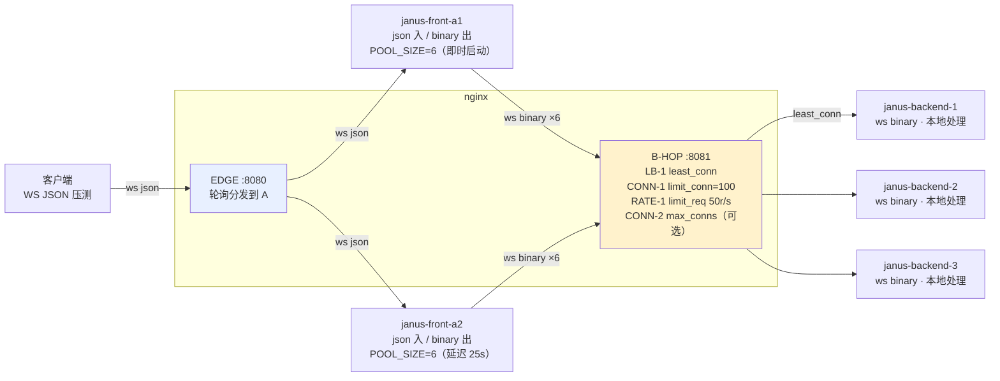
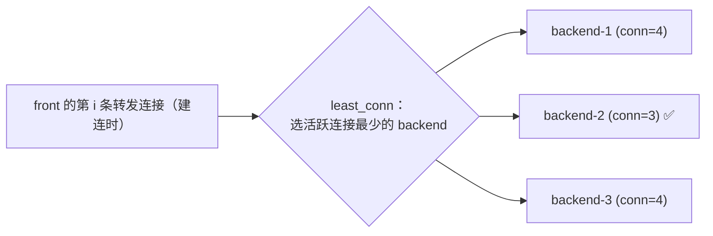
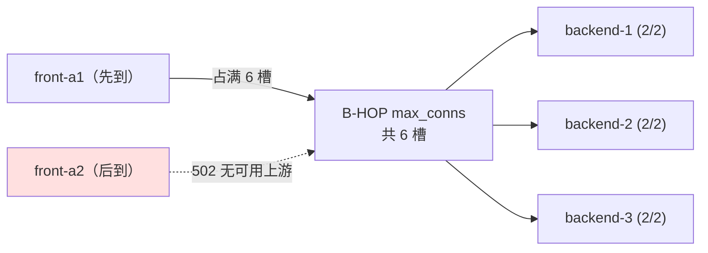
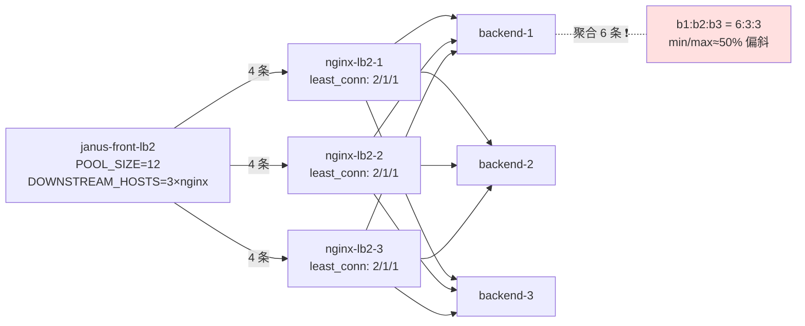
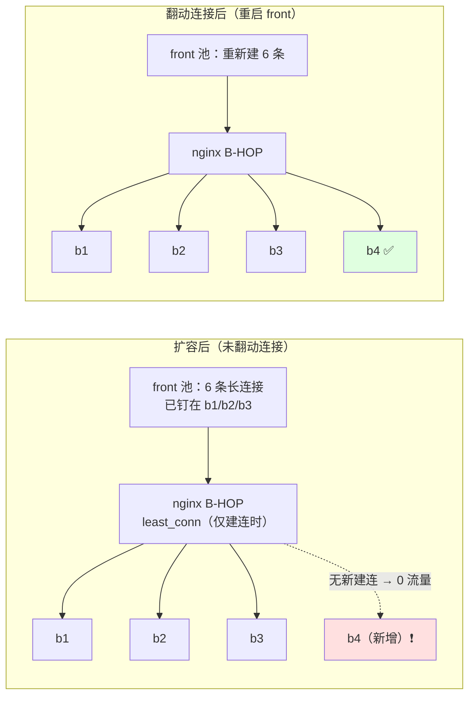
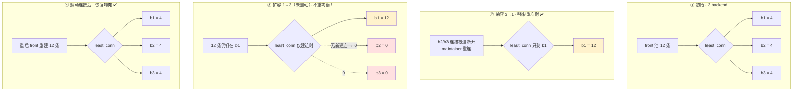
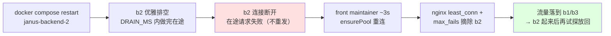
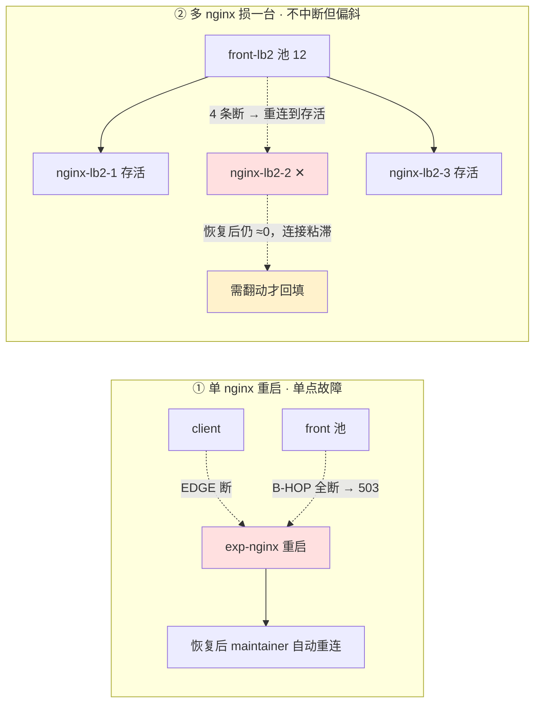

# Janus LB 验证

| 编号 | 实验项 | 机制 | 关注 | 开启方式 |
|------|--------|------|------|---------|
| **LB-1** | front→backend 负载均衡 | B-HOP `least_conn` | backend 三节点均摊 | 默认 |
| **CONN-1** | front→backend 连接数限制 | B-HOP `limit_conn`（**按源 IP**，公平） | 超并发连接被 503 | 默认 |
| **RATE-1** | front→backend 限流 | B-HOP `limit_req` 漏桶（**按源 IP**，公平） | 超速建连被 503 | 默认 |
| **CONN-2** | 共享连接上限 → 上游饥饿 | B-HOP `max_conns`（**每 backend 共享池**，不公平） | 先连的 front 通吃、后到的饿死 | 改 `nginx.conf` + 重启栈 |
| **LB-2** | 多实例 nginx 下的 A→B 均衡 | 多个 nginx **各自独立** `least_conn`（无共享状态） | 聚合到 backend 是否仍均衡 | `--profile lb2` |
| **SCALE-1** | backend 实例扩缩容 | B-HOP `upstream` 增删 server + `reload`；`least_conn` **仅建连时**均衡 | 扩容后连接**粘滞**、需连接翻动才铺到新实例；缩容优雅排空 | `--profile scale` + 改 `nginx.conf` reload |
| **SCALE-2** | backend 缩容到 1 再扩容回 3 | `upstream` 删到 1 台再加回 + `reload`；`least_conn` **仅建连时**均衡 | 缩容强制重均衡、扩容**不**自动重均衡（连接粘滞） | 默认栈 + 改 `nginx.conf` reload + `stop/start` |
| **RESTART-1** | backend 单实例重启 | 优雅排空 + front 池 maintainer **自动重连** + nginx `max_fails` 摘除 | 重启窗口的失败面与恢复时间 | 默认栈 + `docker compose restart` |
| **PROXY-1** | nginx 层扩缩容 / 故障 / 重启 | front→nginx 长连接断开 + 池 maintainer 重连；nginx 成员在 front 侧**静态固定** | 单 nginx = 单点故障；多 nginx 损一台不中断但偏斜；恢复后连接粘滞 | 默认栈（单 nginx）/ `--profile lb2`（多 nginx） |

> **分组说明：**
> - **LB-1 / CONN-1 / RATE-1**：**默认开启**的常规项。
> - **CONN-2**：揭示「共享连接上限」的不公平。
> - **LB-2**：回答「nginx 本身多实例时 A→B 还能否均衡」。
> - **SCALE-1 / SCALE-2 / RESTART-1**：关注 **B 层（backend）单个实例的生命周期**——扩容、缩容、重启时，front↔nginx↔backend 的连接如何断开/重建、流量如何（不）重新铺开、以及恢复所需的时间。
> - **PROXY-1**：把镜头移到 **nginx（代理层）自身**——代理层扩缩容 / 故障 / 重启时，穿过它的长连接会怎样，以及单实例与多实例代理的容错差异。
> 
>后面几项的拓扑 / 容量 / 操作与常规项不同，需按索引末列**按需开启**。

---

## 背景

### 拓扑与角色

| 项 | 说明 |
|---|---|
| 服务数 | 2 层（front、backend） |
| 节点 | **A = front：2 节点**（WS json 入、WS binary 出）；**B = backend：3 节点**（WS binary，终端处理） |
| 代理位置 | nginx 位于 **client→front（EDGE）** 与 **front→backend（B-HOP）** 两跳 |
| 代理协议 | EDGE：WebSocket JSON；B-HOP：WebSocket Binary |
| 下游寻址 | front 用**静态地址**指向 nginx B-HOP（`JANUS_DOWNSTREAM_DISCOVERY=static`），**不走**发现 |



### 连接账本 · 谁在做「按请求均衡」

**连接账本**：

- 每个 front 的 WS 转发池 `JANUS_WS_POOL_SIZE=6`。
- 下游只有 nginx B-HOP 一个静态地址，所以每个 front 的 **6 条**连接全部连到 B-HOP。
- 默认（无 `max_conns`）时两个 front 共 12 条连接，B-HOP 用 `least_conn` 铺到 3 个 backend，即**每个 backend ≈ 4 条**。

> ⚠️ **谁在做「按请求均衡」——是 front，不是 nginx。**（LB-1 / LB-2 / SCALE-1 的共同基石）Janus 的转发连接是**多路复用**的：一条连接用 `request_id` 并发承载大量在途请求。由此：
>
> - **nginx 的 `least_conn` 只做连接级均衡**：它只在**建连那一刻**按「连接数」把连接铺开，之后不再参与请求分配。
>- **真正的按请求均衡由 front 承担**：front 在池内按「**在途请求数**最少（least in-flight）」选连接（`JanusWsClient.pickHealthy()`）。
> - **连接数 ≠ 请求负载**：`least_conn` 看不见一条连接里塞了多少请求，所以它本身**做不到**按请求均衡，只有 front 的 least-in-flight 才能。
> 
> 均摊还依赖 `WS_POOL_SIZE` 是 backend 数的整数倍且连接映射均匀，所以本实验把池设成 6（= 3 的整数倍）。

### 前提 · front 如何"静态"指向 nginx

front 的下游不是「一堆待发现的 backend」，而是「nginx B-HOP 这一个固定地址」（A 与 B 可能分属不同集群，无法跨集群直连发现）。为此用**静态下游**：

```
JANUS_DOWNSTREAM_PROTOCOL=ws        # 下游走 WebSocket
JANUS_DOWNSTREAM_WS_MODE=binary     # 线路编码用 binary（连 nginx 的 /binary）
JANUS_DOWNSTREAM_DISCOVERY=static   # 不走 nacos/etcd，用固定地址
JANUS_DOWNSTREAM_HOST=nginx         # 固定下游主机
JANUS_DOWNSTREAM_PORT=8081          # 固定下游端口（B-HOP）
```

`static` 由 `StaticRegistry` 实现：`discover()` 永远返回 nginx 这**一个**实例，`register()/deregister()` 为空操作。`JanusWsClient.ensurePool()` 于是把整池连接建到 B-HOP。

> **一个 WebSocket = 一次 HTTP/1.1 Upgrade 请求**（CONN-1 / RATE-1 / CONN-2 的共同前提）。因此在 B-HOP 这一跳上：`limit_conn` 限**同时打开**多少连接，`limit_req` 限**新连接建立**的速率，`max_conns` 限**每个 backend**的并发连接数。

### 端口映射

| 地址 | 说明 | 对应实验项 |
|------|------|-----------|
| `ws://localhost:18080/json` | 客户端 → EDGE → front | LB-1 / CONN-2 / SCALE-1 / SCALE-2 / RESTART-1 / PROXY-1①（打流量） |
| `ws://localhost:18081/binary` | B-HOP（经 nginx，供直压） | CONN-1 / RATE-1 |
| `http://localhost:18090/status` | nginx `stub_status` | CONN-1 |
| `http://localhost:19101‑19102/metrics` | front A1 / A2 指标 | CONN-2 / PROXY-1① |
| `http://localhost:19201‑19203/metrics` | backend 三节点指标 | LB-1 / CONN-2 / LB-2 / RESTART-1 / SCALE-1 / SCALE-2 / PROXY-1② |
| `http://localhost:19204/metrics` | backend-4 指标（`--profile scale`） | SCALE-1 |
| `ws://localhost:18082/json` | 客户端 → LB-2 专属 front（`--profile lb2`） | LB-2 / PROXY-1② |
| `http://localhost:19103/metrics` | LB-2 front 指标（`--profile lb2`） | LB-2 / PROXY-1② |
| `http://localhost:9090` / `:3000` | Prometheus / Grafana（`--profile obs`） | 可选 |

### 验证脚本

```bash
docker compose -f docker/docker-compose.exp.yml --project-directory . up --build
# 附带可观测栈（Prometheus + Grafana）：追加 --profile obs
# 起栈后等 ~30s（front-a2 延迟 25s 启动），再做验证
```

> `--project-directory .` 是必需的，使构建上下文回到项目根目录。front-a2 故意延迟启动：对LB-1/CONN-1/RATE-1 无影响（等 30s 即可），并让 CONN-2 的「谁先占满谁通吃」变得确定。

一键验证脚本（每项独立，缺工具则跳过并标 SKIP；打印 `expected/actual/result` 与总判定，退出码 0=全通过 / 1=有失败 / 2=全跳过）：

```bash
bash docker/nginx/validate.sh all       # LB-1 + CONN-1 + RATE-1（默认配置）
bash docker/nginx/validate.sh lb        # 也可单跑：lb | conn | rate
bash docker/nginx/validate.sh starve    # CONN-2（需先在 nginx.conf 打开 max_conns 并重启栈）
bash docker/nginx/validate.sh lb2       # LB-2（需 --profile lb2 起多 nginx 栈）
bash docker/nginx/validate.sh scale     # SCALE-1（需 --profile scale + 放开 backend-4 并 reload；用到 docker CLI）
bash docker/nginx/validate.sh restart   # RESTART-1（默认栈；脚本会 docker compose restart 一个 backend）
```

> 改 `docker/nginx/nginx.conf` 后热加载（CONN-2 除外，见其小节）：
> `docker compose -f docker/docker-compose.exp.yml --project-directory . exec nginx nginx -s reload`

> **SCALE-2 / PROXY-1 为手动 / 观测型实验**（不在 `validate.sh` 内）：按各自小节的 `docker compose` 步骤操作，用 backend / front 的 `/metrics` 与日志核对。

---

## LB-1

> front→backend 负载均衡（least_conn）

### 机制

⚠️ **注意 `least_conn` 的能力边界**：nginx 只能在**建连时**按「活跃连接数」把连接铺到各backend——这是**连接级**均衡。多路复用下连接数与请求负载脱钩，所以**按请求均衡由 front 承担**
（池内 least in-flight，见〈公共背景 · 连接账本〉），`least_conn` 只负责让连接尽量均匀落到 3 个backend。



```nginx
upstream janus_backends {
    zone janus_backends 64k;
    least_conn;
    server janus-backend-1:8080 max_fails=3 fail_timeout=10s;   # max_fails/fail_timeout 见 RESTART-1
    server janus-backend-2:8080 max_fails=3 fail_timeout=10s;
    server janus-backend-3:8080 max_fails=3 fail_timeout=10s;
}
server { listen 8081; location / { proxy_pass http://janus_backends; ... } }   # WS Upgrade 透传
```

### 验证

脚本对 backend 指标做**前后快照取增量**，避免累计污染。

- **expected**：3 个 backend 各 ≈1/3（180 请求），无 0，min/max ≥ 50%。
- **actual**：`b1=.. b2=.. b3=..（Δtotal, min/max=..%）`。
- **PASS**：min>0 且 min/max ≥ 50%。**排查**：某 backend ≈0 → `JANUS_WS_POOL_SIZE` < backend 数，
  或 `least_conn` 映射不均。

### 调参

| 参数 | 位置 | 说明 |
|------|------|------|
| `least_conn` / `ip_hash` / 轮询 | `upstream janus_backends` | 长连接推荐 `least_conn`；会话粘滞用 `ip_hash` |
| `JANUS_WS_POOL_SIZE` | compose 的 front env | **务必为 backend 数整数倍且留足**（当前 6，backend=3 → 每 backend 每 front 2 条） |

---

## CONN-1

>  front→backend 连接数限制（limit_conn，按源 IP）

### 机制

按客户端 key（源 IP）限制**并发连接数**，超出的连接在 Upgrade 阶段被 503 拒绝。**每个 front 是
不同容器 = 不同 IP → 各有独立配额，彼此不会饿死**（与 CONN-2 的共享池形成对比）。

```nginx
limit_conn_zone $binary_remote_addr zone=ws_conn:10m;
limit_conn_status 503;
server { listen 8081; limit_conn ws_conn 100; ... }
```

### 验证

- **expected**：并发保持 150 条 → ~100 接受 / ~50 拒(503)，rejected ≥ 20。
- **actual**：`accepted≈.. rejected≈..` + `nginx stub_status`。
- **PASS**：rejected ≥ 20（直压 :18081，来自宿主机同一 IP，触发 per-IP `limit_conn`）。

### 调参

| 参数 | 位置 | 说明 |
|------|------|------|
| `limit_conn ws_conn N` | B-HOP server 块 | 每源 IP 并发连接上限 |

> **限流粒度提醒**（同样适用 RATE-1）：容器内客户端可能共享同一源 IP，此时 CONN-1/RATE-1 作用于聚合流量。要按客户端区分，用不同源 IP 压测，或把 `limit_*_zone` 的 key 改成请求头（如`$http_x_client_id`）。

---

## RATE-1

> front→backend 请求限流（limit_req 漏桶，按源 IP）

### 机制

漏桶：`rate` 定常速，`burst` 吸收突发，`nodelay` 让突发内的建连立即处理，超过 `rate+burst` 的**新连接建立**被拒（503）。一条 WS 只有一次 Upgrade，所以限的是**建连速率**；同样**按源 IP**计，
各 front 独立。

```nginx
limit_req_zone $binary_remote_addr zone=ws_req:10m rate=50r/s;
limit_req_status 503;
server { listen 8081; limit_req zone=ws_req burst=100 nodelay; ... }
```

### 验证

- **expected**：快开快关 300 条 → 超 `rate(50)+burst(100)` 被拒，rejected ≥ 20。
- **actual**：`accepted≈.. rejected≈..`。
- **PASS**：rejected ≥ 20。

### 调参

| 参数 | 位置 | 说明 |
|------|------|------|
| `rate=` / `burst=` / `nodelay` | `limit_req_zone` / server | 常速、突发桶、是否立即处理突发 |

---

## CONN-2

> 共享连接上限 → 上游饥饿（max_conns，默认关闭）

### 机制

`max_conns` 限制**每个 backend**的并发连接数——这是一份**所有 front 共享**的容量池。

本实验的配比：`max_conns=2 × 3 backend = 共 6 槽`，而每个 front 池=6。于是会连锁触发饥饿：

1. **先连上的 front（a1）把 6 槽全占满。**
2. 后到的 front（a2）到 B 的所有 Upgrade 都因「无可用上游」被 nginx **在 B-HOP 侧返回 502**。
3. a2 的转发池因此建不起来。
4. 进而 a2 对每个**客户端**请求都在 `route()` 里返回 **503**。

> **两级错误要分清**：**502 是 nginx→front 侧**（无可用上游），**503 是 front→client 侧**（下游不可用）。



后果分三层，且很隐蔽：

| 层 | 现象 | 说明 |
|----|------|------|
| **A 层** | 严重不均：a1 全部成功，a2 全部 503 | EDGE 轮询把客户端请求 ≈50/50 分给 a1/a2 |
| **客户端** | 约**一半请求返回 503** | a2 走 `route()` 的 `downstream WS unavailable` 分支 |
| **B 层** | b1≈b2≈b3，**看似均衡** | B 只被 a1 喂 → 后端指标"骗过"你，藏住 a2 已死 |

a2 不会本地伪造结果——`ChainHandler.route()` 在下游不可用时**显式返回 503**：

```java
if (ServerConfig.isWsDownstream()) {
    if (wsClient != null && wsClient.isConnected()) {
        return forwardViaWs(request, traceContext, parentSpan);
    }
    log.warn("WS downstream configured but unavailable [{}]; returning 503", method);
    return JanusMessage.error(method, 503, "downstream WS unavailable");
}
```

> **CONN-1 vs CONN-2 是本实验的关键对照**：`limit_conn` 按**源 IP** → 各 front 独立配额，公平、不饿死；`max_conns` 是**每 backend 的共享池** → 无公平性，谁先连谁通吃。

### 验证（先开 max_conns 再重启栈）

- **expected**：EDGE 轮询 ≈50/50 → `success(a1) ≈ starved-503(a2)`；backend `b1≈b2≈b3` 但Σ ≈ N 的一半（只有 a1 在喂）。
- **actual**：`success(a1)=.. starved-503(a2)=..`；backend 各节点计数；`docker logs janus-front-a2`反复出现 `WS downstream configured but unavailable ... returning 503`。
- **PASS**：starved-503 ≥ N/4 且 success ≥ N/4（即成功复现「a2 饿死、a1 扛全部」的不均衡）。

### 调参

**开启步骤**：编辑 `nginx.conf`，把三个 backend `server` 行末尾加上 ` max_conns=2`（配置里已用注释标出位置），然后**重启栈**（非 reload，需从干净状态重新建连）：

```bash
docker compose -f docker/docker-compose.exp.yml --project-directory . up -d --force-recreate
# worker_processes 已固定为 1（确定性），无需改。a1 先占满 6 槽，a2 饿死。
```

**缓解方向**（供设计参考）：

| 方向 | 做法 |
|------|------|
| **留足余量** | B 侧总容量 ≥ Σ(各 front 池大小)，让上限只兜底、不成为常态瓶颈 |
| **按上游配额** | 用 `limit_conn` 以 front 身份为 key（如自定义头 `X-Janus-Front-Id`），给每个 front 独立配额而非抢占共享池 |
| **预留槽位** | 为每个已知 front 预留最小连接数，避免被单个 front 吃干 |
| **前置限速** | 在 front→B 入口按 front 限制建连速率/并发，避免单个 front 瞬间把共享池占满 |

---

## LB-2

> 多实例 nginx 下的 A→B 均衡（各自独立 least_conn，`--profile lb2`）

### 机制

当 nginx **本身是多实例**时，front 的转发池会分散连到多个 nginx。此时：

- 每个 nginx 只按**自己本地看到的连接数**做 `least_conn`，**实例之间不共享状态**。
- 各 nginx 的 tie-break（连接数打平时选哪个 backend）是**相互关联**的——都倾向按同一顺序把「多出来的」连接放到同一个 backend。
- 结果：**偏斜不会互相抵消，反而叠加**。

本项用一个专属 front（池=12）扇出到 **3 个 nginx**（每个 4 条）。4 不是 backend 数 3 的整数倍，所以每个 nginx 都落成 `2/1/1`（多出的第 4 条按 tie-break 归到 backend-1），三个 nginx 叠加 →
**`6/3/3`**：



**结论**：多实例 nginx **不自动保证** A→B 均衡。能否均衡，取决于「**每个 nginx 分到的连接数是否是backend 数的整数倍**」：

- **整除时**恰好均衡：如 pool=9 → 每 nginx 3 → `1/1/1` → 聚合 `3/3/3`。
- **不整除时偏斜**：余数被各实例**关联地**堆到同一 backend → 叠加成偏斜。

因为 nginx 之间无共享连接账本，这种均衡是**脆弱的、依赖配比的巧合**：规模越大（nginx 越多、每实例连接越少）越容易偏。真正稳的做法仍是让 **front 端按在途请求数（least in-flight）分发**（见 LB-1 与〈公共背景 · 连接账本〉），不把均衡责任压在互不通气的多个 nginx 上。

> 代码支持：`JANUS_DOWNSTREAM_HOSTS`（逗号分隔 `host[:port]`）让 front 的静态下游指向**多个** nginx，
> `JanusWsClient.ensurePool()` 按轮询把池连接铺到各实例（`StaticRegistry` 现支持实例列表）。

### 验证（`--profile lb2`）

先带 profile 起栈：

```bash
docker compose -f docker/docker-compose.exp.yml --project-directory . --profile lb2 up --build
# 等 ~30s 后：bash docker/nginx/validate.sh lb2
```

- **expected**：LB-2 front 池=12 扇出到 3 个 nginx（每个 4 条），4 不整除 3 → 每 nginx `2/1/1` → 聚合 `b1:b2:b3 ≈ 6:3:3`，min/max ≈ 50%（偏斜）。
- **actual**：`b1=.. b2=.. b3=..（Δtotal, min/max=..%）`（backend 增量）。
- **PASS**：min/max ≤ 65%，即**复现了预测的偏斜**——证明多个互不通气的 nginx **不自动**均衡 A→B。

### 调参

| 参数 | 位置 | 说明 |
|------|------|------|
| `--profile lb2` + `JANUS_DOWNSTREAM_HOSTS` | compose 的 `janus-front-lb2` | 用 `--profile lb2` 起 3 个 nginx + 专属 front（已配好指向 3 个 nginx） |
| `JANUS_WS_POOL_SIZE`（front-lb2） | compose 的 `janus-front-lb2` env | 12→每 nginx 4→偏斜 `6/3/3`；改 **9**→每 nginx 3→均衡 `3/3/3`（min/max→100%）。规律：**每 nginx 分到的连接数须为 backend 数整数倍**才均衡 |
| nginx 实例数 | compose profile `lb2` 的 `nginx-lb2-*` | 增减 nginx 实例；实例越多、每实例连接越少，越易因关联 tie-break 偏斜 |

---

## SCALE-1

> backend 实例扩缩容（upstream 增删 + reload，`--profile scale`）

### 机制

**前提**：front 只认识 nginx B-HOP 这**一个**静态地址，**看不见** backend 的成员变化（A/B 可能跨集群，B 不走服务发现）。所以「给 B 扩缩容」不是改发现中心，而是**改 nginx 的 `upstream` 成员表
再 `reload`**：

- **扩容（3→4）**：起一个 `janus-backend-4`（`--profile scale`），在 `nginx.conf` 的`upstream janus_backends` 里放开 `server janus-backend-4:8080` 一行，然后 `nginx -s reload`。
- **缩容（3→2）**：把某个 `server` 行注释掉 `reload`，再 `docker compose stop` 掉该实例（或反过来——停机后 nginx 靠 `max_fails` 也会摘除，但显式改配置更干净）。

⚠️ **关键现象：扩容后新实例几乎收不到流量，直到连接翻动。** 原因和 LB-1 同源——`least_conn` **只在建连那一刻**按连接数铺开；而 front 的转发连接是**长连接 + 多路复用**，`reload` 不会断开已建立的
连接。于是：



要让 b4 真正分到负载，必须**让连接重建**。触发连接翻动的方式有三种：

- 重启 front（`docker compose restart janus-front-a1 janus-front-a2`）；
- 或让池因故断连重连；
- 或扩大 `JANUS_WS_POOL_SIZE`。

翻动后 `ensurePool()` 按轮询把新池连接铺到 nginx，nginx 再 `least_conn` 均摊到 **4** 个 backend → `≈1/4` 各一份。

> **缩容**相对温和：被停实例上的连接断开，front 的池 maintainer（每 3s 跑一次 `ensurePool()`，先`removeIf(!isOpen)` 再补齐）会把缺口重连到 nginx → `least_conn` 落到**剩余** backend 上。若被停实例开着优雅排空（`JANUS_SHUTDOWN_DRAIN_MS`，见 RESTART-1），在途请求能先做完再断，减少失败。

### 验证（`--profile scale` + reload）

**前置**：`--profile scale` 起栈（含 backend-4）→ 在 `nginx.conf` 放开 `janus-backend-4` 那行 → `docker compose … exec nginx nginx -s reload`。脚本用到 `docker` CLI（缺则 SKIP）。

- **expected**：**phase A**（刚 reload、未翻动连接）backend-4 **≈ 0**——`least_conn` 只在建连时均衡，存量长连接仍钉在 b1..b3；**phase B**（脚本重启 a1/a2 翻动连接后）4 个 backend **各 ≈1/4**、b4 > 0，min/max ≥ 50%。
- **actual**：`phaseA b4=.. (want ≈0) ; phaseB 4-way min/max=..%`。
- **PASS**：phase A `b4 ≤ 10`（几乎收不到）**且** phase B `min>0 且 min/max ≥ 50%`（翻动后均摊到 4 节点）。**排查**：phase A 就有 b4>0 → 连接已被别的原因翻动过；phase B 仍偏斜 → reload 没生效或等待不足。

### 调参 / 操作步骤

**扩容步骤**：
```bash
# 1) 起扩容实例（backend-4）
docker compose -f docker/docker-compose.exp.yml --project-directory . --profile scale up -d
# 2) 编辑 docker/nginx/nginx.conf，放开 upstream 里注释掉的这一行：
#      server janus-backend-4:8080 max_fails=3 fail_timeout=10s;
# 3) 热加载 nginx（无需重启）
docker compose -f docker/docker-compose.exp.yml --project-directory . exec nginx nginx -s reload
# 4) 验证（脚本自带「翻动连接」的 phase B）
bash docker/nginx/validate.sh scale
```

| 参数 | 位置 | 说明 |
|------|------|------|
| `upstream` 增删 `server` + `reload` | `docker/nginx/nginx.conf` | 扩容放开 `janus-backend-4` 行、缩容注释某行，`nginx -s reload`；**存量长连接不重排**，需翻动 |
| `--profile scale` / `JANUS_WS_POOL_SIZE` | compose 的 `janus-backend-4` / front env | 起/停扩容实例；池越大、翻动后铺得越匀。翻动连接：`docker compose restart janus-front-a1 janus-front-a2` |

> 缩容：把某个 `server` 行注释掉后 `nginx -s reload`，再 `docker compose … stop janus-backend-3`。无论扩缩，**存量长连接都不会自动重排**——要立即生效需翻动连接（重启 front）。

---

## SCALE-2

> backend 缩容到 1 再扩容回 3（重均衡的不对称性）

### 机制

SCALE-1 已经指出「扩容后新实例吃不到流量」。本项把它推到极端，回答一个常被问到的问题：**先把 backend 从 3 台缩到 1 台，再扩回 3 台，连接能自动重新均摊回 3 份吗？**

答案是**不能**——因为缩容和扩容对长连接的作用**不对称**：

| 动作 | 对连接的作用 | 是否自动重均衡 |
|------|-------------|--------------|
| **缩容（3→1）** | 被摘/停实例上的连接**被迫断开**，front 池 maintainer 重连，`least_conn` 只剩 b1 可选 → 全部落到 b1 | **会**（连接被迫重建，自然收敛到存活实例） |
| **扩容（1→3）** | b2/b3 加回后，存量连接**不断开**；`least_conn` 只在建连时均衡 → 不重排 | **不会**（连接粘滞在 b1，b2/b3 收不到流量） |

换言之：**缩容靠"强制断连"顺带完成了重均衡，扩容却没有任何力量去打散已经钉死的连接**。要让扩容后的 b2/b3 重新分到负载，和 SCALE-1 一样必须**翻动连接**（重启 front）。



### 验证（默认栈 · 手动操作 + backend 指标观测）

> 本项为**手动 / 观测型**实验（无专用 `validate.sh` 目标）：按下述步骤操作，用三个 backend 的 `/metrics`（`ws_messages_total` 增量）核对流量分布。

**操作步骤：**

```bash
# 0) 默认栈起好，另开终端持续打一股均匀流量到 ws://localhost:18080/json

# 1) 缩容 3→1：注释掉 nginx.conf 里 janus-backend-2 / -3 两行 server（行首加 '#'），reload，再停容器
docker compose -f docker/docker-compose.exp.yml --project-directory . exec nginx nginx -s reload
docker compose -f docker/docker-compose.exp.yml --project-directory . stop janus-backend-2 janus-backend-3
#    → 观测：b1 计数快速上涨，b2/b3 归零（连接被迫重连、全部落到 b1）

# 2) 扩容 1→3：放开 b2/b3 两行注释，reload，再启动容器
docker compose -f docker/docker-compose.exp.yml --project-directory . start janus-backend-2 janus-backend-3
docker compose -f docker/docker-compose.exp.yml --project-directory . exec nginx nginx -s reload
#    → 观测：b2/b3 起来了，但计数仍≈0（连接粘滞在 b1）——这就是「扩容不自动重均衡」

# 3) 翻动连接：重启两个 front，逼池重建
docker compose -f docker/docker-compose.exp.yml --project-directory . restart janus-front-a1 janus-front-a2
#    → 观测：b1/b2/b3 重新 ≈ 4/4/4
```

- **expected**：
  - **缩容后**：`b1 ≈ 100%`，`b2 = b3 = 0`（连接被迫重连、`least_conn` 只剩 b1）。
  - **扩容后未翻动**：`b1 ≈ 100%`（b2/b3 已起但收不到流量），`min/max ≈ 0`。
  - **翻动后**：`b1 ≈ b2 ≈ b3`，`min/max ≥ 50%`。
- **actual**：三阶段各记录 `b1/b2/b3` 的 `ws_messages_total` 增量与 `min/max%`。
- **PASS**：缩容后 b1 独占且 b2=b3=0；**扩容后未翻动仍 b1 独占**（复现"不自动重均衡"）；翻动后 `min/max ≥ 50%`（复现"翻动才重均衡"）。

### 调参 / 操作步骤

| 参数 | 位置 | 说明 |
|------|------|------|
| `upstream` 增删 `server` + `reload` | `docker/nginx/nginx.conf` | 缩容注释 b2/b3、扩容放开，`nginx -s reload`；**存量长连接不重排** |
| `docker compose stop / start` | backend 容器 | 缩容停实例（连接被迫断 → 重均衡）、扩容起实例 |
| 翻动连接：`restart` front | `janus-front-a1/-a2` | 扩容后唯一能重新铺开连接的手段（或扩大 `JANUS_WS_POOL_SIZE` 让新建连更多） |

> **一句话结论**：连接级 `least_conn` 下，**缩容能自动收敛、扩容不能自动铺开**。任何"加机器就自动分担"的预期，在长连接 + 建连时均衡的模型里都不成立——必须辅以连接翻动（重启 / 断连重连 / 扩池）。

---

## RESTART-1

>  backend 单实例重启（优雅排空 + 自动重连 + 被动摘除）

### 机制

重启某个 backend（`docker compose restart janus-backend-2`）会经历「**下线 → 空窗 → 上线**」，沿途几处机制协同决定失败面与恢复速度：

1. **优雅排空（被重启方）**：backend 收到 SIGTERM 后，先暂停 `JANUS_SHUTDOWN_DRAIN_MS`（默认2000ms）让在途请求做完，再关监听。窗口内的请求大多能正常返回。
2. **连接断开 → 请求失败面**：backend 关闭后，钉在它上面的 front↔nginx↔backend 连接断开。这些连接上**已发出、尚未收到回复**的在途请求会失败——按 `JanusWsClient` 的**安全重试**语义（R1），
   **已经上线（send 成功）的请求不会重发**（避免非幂等重复），而是把失败**如实**上抛给调用方。所以重启窗口内会看到一小撮请求失败，这是**预期**的、也是诚实的。
3. **front 自动重连**：池 maintainer 每 3s `ensurePool()`，把断掉的连接重连到 nginx B-HOP →`least_conn` 落到**健康**的 backend。未受影响的其余连接（钉在 b1/b3）继续正常服务，所以失败面
   被限制在「b2 那几条连接的在途请求」，而非全部流量。
4. **nginx 被动摘除**：`max_fails=3 fail_timeout=10s`——重启空窗里，若有新建连打到还没起来的 b2 连续失败 3 次，nginx 就把 b2 标记 DOWN、`fail_timeout` 内只往健康实例建连；过后再试探性放回。这
   让重连能快速绕开死实例。
5. **`proxy_next_upstream off` 的代价**：本实验为让 CONN-2 快速失败而设了 `proxy_next_upstream off`
   ——因此在「b2 已死但还没被 `max_fails` 摘除」的极短窗口里，恰好落到 b2 的**新建连**不会被 nginx
   改投其它实例，而是直接失败（由 front 下一轮重连补救）。这是一个刻意的取舍（见下方调参：打开
   `proxy_next_upstream` 可把这部分失败也自动改投，代价是与 CONN-2 的「立即暴露拒绝」相冲突）。



> **恢复但不自动回填**：b2 重新起来后，nginx 会重新把它纳入候选，但 front 那些**已经重连到 b1/b3
> 的长连接不会主动挪回** b2——和 SCALE-1 同理，`least_conn` 不重排存量连接。要让 b2 重新分到负载，
> 同样需要连接翻动。因此「恢复」指的是**流量恢复到健康实例、客户端不再报错**，而非三节点立刻重新
> 均摊。

### 验证（默认栈 + docker restart）

- **expected**：脚本边打流量边 `docker compose restart janus-backend-2`——重启窗口内**允许**少量
  请求失败（b2 那几条连接的在途请求）；等 ~12s 让 front 池 maintainer 重连后，**干净的恢复批次
  ≈ 100% 成功**（流量已落到健康实例）。
- **actual**：`during-restart: success=.. non-success≈..`；`recovery batch success R/M (..%)`。
- **PASS**：恢复批次成功率 **≥ 95%**（证明 front 经 nginx 自动重连、服务恢复）。**排查**：恢复率低→ 加长等待、或确认 b2 已重新起来（`docker ps`）、或看 `docker logs janus-front-a1` 是否在重连。
  注意「恢复」是**流量恢复**，非三节点立刻重新均摊（存量连接不回迁 b2，见上方机制）。

### 调参 / 操作步骤

```bash
# 默认栈即可（无需 profile）；脚本会在打流量的同时重启一个 backend 并校验恢复
bash docker/nginx/validate.sh restart
# 手动观察：一边打流量，一边重启，看 front 日志的重连
docker compose -f docker/docker-compose.exp.yml --project-directory . restart janus-backend-2
docker compose -f docker/docker-compose.exp.yml --project-directory . logs -f janus-front-a1
```

| 参数 | 位置 | 说明 |
|------|------|------|
| `max_fails` / `fail_timeout` | `upstream janus_backends` 的 `server` | 被动健康检查：几次失败后摘除多久。调小 → 更快绕开死实例，但更易误摘 |
| `JANUS_SHUTDOWN_DRAIN_MS` | compose 的 backend env | 优雅排空窗口（默认 2000ms）：让在途请求做完再断，减少重启失败面；设 0 = 快断（失败更多） |
| `JANUS_WS_CONN_LOST_TIMEOUT_SEC` | compose 的 front env | 连接探活窗口（默认 20s）：越小越快发现半开连接并重连、恢复更快 |
| `proxy_next_upstream` | B-HOP `location /` | 本实验为 CONN-2 设成 `off`；改成 `error timeout http_502 http_503 non_idempotent` 可把「打到死实例的新建连」自动改投健康实例（代价：与 CONN-2 立即暴露拒绝冲突） |

> 想缩短恢复时间：调小 `JANUS_WS_CONN_LOST_TIMEOUT_SEC`（更快发现断连）与 nginx `fail_timeout`
> （更快放回）；想减少重启失败面：保证 `JANUS_SHUTDOWN_DRAIN_MS` 足够让在途请求做完。

---

## PROXY-1

> nginx 层（代理层）扩缩容 / 故障 / 重启对长连接的影响

前面 SCALE-1 / SCALE-2 / RESTART-1 都在折腾 **B 层（backend）**。本项把镜头移到**中间的 nginx（代理层）自身**：当代理层扩缩容、某个 nginx 故障或重启时，**穿过它的长连接**会怎样。

nginx 在本栈同时承载**两跳长连接**，都会受影响：

| 连接 | 方向 | 谁负责重连 |
|------|------|-----------|
| **client → EDGE**（:8080） | 客户端 ↔ nginx | **客户端自己**（nginx 不持久化连接；重启后客户端需重新握手） |
| **front → B-HOP**（:8081） | front 转发池 ↔ nginx | **front 池 maintainer**（每 3s `ensurePool()` 自动重连） |

### 机制

**关键前提**：front 的下游 nginx 列表来自 `JANUS_DOWNSTREAM_HOST(S)`，由 `StaticRegistry` 在**启动时固定**，运行期**不重读、不做健康过滤**（`discover()` 恒返回配置里的全部 nginx）。这带来两个直接后果：

- **代理层"缩/扩"对 front 不透明**：往 front 的视野里增删 nginx，必须改 `JANUS_DOWNSTREAM_HOSTS` 并**重启 front**——不像 backend 扩缩容只需 `nginx -s reload`（backend 成员藏在 nginx 里，对 front 透明）。
- **死 nginx 仍在候选里**：某 nginx 宕机时 `discover()` 照样把它列出，maintainer 重连会反复尝试它并失败，直到它恢复；期间连接自然集中到存活实例。

分两种部署看容错：

**① 单实例 nginx（默认栈）——单点故障**

默认栈只有一个 `exp-nginx`，同时是 EDGE 和 B-HOP。它重启 = **两跳同时全断**：

1. client→EDGE 连接全断 → 客户端侧感知断开，需自行重连。
2. front→B-HOP 池连接全断 → `ensurePool` 清掉死连接、`discover()` 仍返回 nginx，但重启窗口内 `connectWithRetry` 失败 → 池空 → front 对每个客户端请求返回 **503**（`downstream WS unavailable`）。
3. **整条路径在 nginx 宕机期间不可用**——典型的单点故障。
4. 恢复：nginx 回来 → maintainer 3s 内重连满 6 条 → front 侧服务恢复；客户端侧需自己重连 EDGE。

**② 多实例 nginx（`--profile lb2`）——无单点，但偏斜 + 粘滞**

`front-lb2` 池=12 扇到 3 个 nginx（各 4 条）。重启 / 停掉其中一个（如 `nginx-lb2-2`）时：

1. 钉在 nginx-lb2-2 上的 4 条断开；另外 8 条（在 nginx-1/-3）**不受影响，流量不中断**。
2. maintainer 补 4 个空槽：因 `discover()` 仍含死的 nginx-lb2-2，轮询重连里打到它的那次失败、打到 nginx-1/-3 的成功 → 连接**集中到存活实例**（略偏斜），路径持续可用。
3. **恢复后不回填**：nginx-lb2-2 起回来后，池已满 12 条、全钉在 nginx-1/-3，maintainer 只补缺口、不主动搬迁 → nginx-lb2-2 **≈ 0 流量**，直到连接翻动（重启 `front-lb2`）。这与 SCALE-1 / SCALE-2 的粘滞同源，只是发生在**代理层**。



### 验证（手动操作 + front / backend 指标观测）

> 本项为**手动 / 观测型**实验（无专用 `validate.sh` 目标）。核心看两点：**故障期间路径是否可用**、**恢复后连接是否回填**。

**① 单实例（默认栈）：**

```bash
# 持续打流量到 ws://localhost:18080/json，另开终端：
docker compose -f docker/docker-compose.exp.yml --project-directory . restart nginx
docker compose -f docker/docker-compose.exp.yml --project-directory . logs -f janus-front-a1
```

- **expected**：重启窗口内客户端请求大面积失败（front 返回 503，日志 `downstream WS unavailable`）；nginx 回来 ~几秒后，front 日志出现重连、请求恢复成功。
- **PASS**：**存在明显失败窗口**（证明单点故障）**且**恢复后请求成功率回到正常（证明 maintainer 自动重连）。

**② 多实例（`--profile lb2`）：**

```bash
docker compose -f docker/docker-compose.exp.yml --project-directory . --profile lb2 up -d
# 打流量到 ws://localhost:18082/json（LB-2 专属 front），另开终端：
docker compose -f docker/docker-compose.exp.yml --project-directory . restart nginx-lb2-2
# 观察 3 个 backend 指标：重启期间总量基本不掉（存活 nginx 扛住），恢复后经该 nginx 的连接仍 ≈0，直到：
docker compose -f docker/docker-compose.exp.yml --project-directory . restart janus-front-lb2
```

- **expected**：损一台 nginx **不造成整体中断**（区别于单实例）；恢复后经该 nginx 的连接**不自动回填**，翻动 `front-lb2` 后才重新铺开。
- **PASS**：多实例下**无整段 503 窗口**（对照 ① 的单点故障）**且**复现"恢复后需翻动才回填"的粘滞。

### 调参 / 设计建议

| 方向 | 做法 |
|------|------|
| **消除单点** | 代理层至少 2 实例，front 用 `JANUS_DOWNSTREAM_HOSTS` 扇出（`--profile lb2` 即此形态）；单 nginx 只适合实验 / 非关键路径 |
| **让代理层扩缩容透明** | front 指向**稳定的 VIP / DNS 名**（背后挂多台 nginx），而非把每台 nginx 硬编码进 `JANUS_DOWNSTREAM_HOSTS`；否则增删 nginx 需改配置并重启 front |
| **加快故障发现** | 调小 `JANUS_WS_CONN_LOST_TIMEOUT_SEC`（front 更快发现死连接并重连）；maintainer 周期（3s）决定重连节奏 |
| **恢复后主动再均衡** | 代理层实例恢复 / 新增后连接不会自动回填——需翻动 front（滚动重启），或缩短连接生命周期让其周期性重建 |

> 与 backend 侧完全一致的一条规律：**`least_conn` + 长连接 = 只在建连时均衡**。无论故障发生在 backend 还是 nginx 层，**存活期不重排、恢复后不回填**，重新均衡都要靠连接翻动。

---

## 相关文件

| 文件 | 说明 |
|------|------|
| `docker/docker-compose.exp.yml` | 单实验栈：2 front（a1 即时 / a2 延迟）→ nginx（EDGE + B-HOP）→ 3 backend；`--profile lb2` 额外起 3 个 nginx + 专属 front（LB-2 / PROXY-1 多实例）；`--profile scale` 额外起 `janus-backend-4`（SCALE-1）；`--profile obs` 起可观测栈。SCALE-2（默认栈 + `stop/start`）与 PROXY-1（单 nginx 用默认栈、多 nginx 用 `--profile lb2`）复用已有服务，无需新增 |
| `docker/nginx/nginx.conf` | nginx（单 worker，确定性）：EDGE 轮询 + B-HOP 的 LB-1 / CONN-1 / RATE-1 / CONN-2（`max_conns` 可选）/ SCALE-1（`janus-backend-4` server 行可选）/ SCALE-2（`upstream` 删到 1 台再加回）/ RESTART-1（`max_fails`/`fail_timeout` 被动摘除）；同一份配置被所有 nginx 实例复用（含 LB-2 / PROXY-1） |
| `docker/nginx/prometheus.exp.yml` | 抓取 front（a1/a2/lb2）+ 3 backend 指标 |
| `docker/nginx/validate.sh` | 验证脚本（`lb` / `conn` / `rate` / `starve` / `lb2` / `scale` / `restart` / `all`，含 expected/actual/PASS-FAIL）；SCALE-2 / PROXY-1 为手动观测，不在脚本内 |
| `src/main/java/org/janus/config/ServerConfig.java` | 静态下游配置（`isStaticDiscovery` / `DOWNSTREAM_HOST` / `DOWNSTREAM_PORT` / **`DOWNSTREAM_HOSTS` 多实例**） |
| `src/main/java/org/janus/discovery/StaticRegistry.java` | 静态下游 registry（单个或**多个** host:port 实例列表） |
| `src/main/java/org/janus/JanusServer.java` | 解析 `JANUS_DOWNSTREAM_HOSTS` 成静态实例列表 |
| `src/main/java/org/janus/ws/JanusWsClient.java` | front 的 WS 转发池（按轮询把连接铺到各静态实例、least-in-flight 选连接） |
| `src/main/java/org/janus/handler/ChainHandler.java` | `route()`：下游不可用时返回 503（不本地伪造） |
